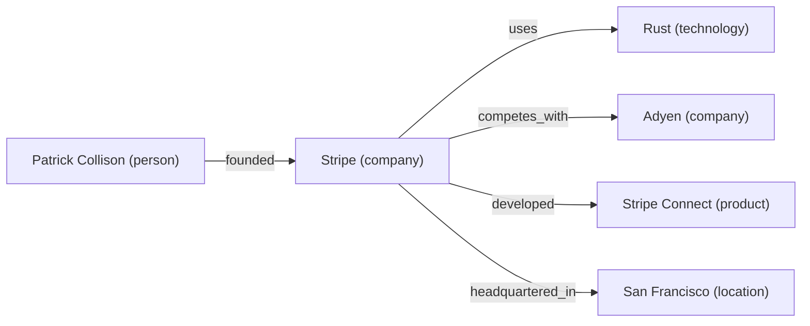

## Overview

The knowledge graph is OpenClaw Browser's most powerful research tool. As you browse, you can extract entities (companies, people, technologies, products) and connect them with relationships. The graph accumulates across pages and sessions, building a structured picture of everything you have researched.

Combined with the knowledge cache and semantic search, the graph turns unstructured web content into a queryable network of facts.

---

## Architecture

The knowledge graph is an in-memory store with three core concepts:

- **Entities** -- named nodes with a type and key-value attributes (e.g., "Stripe" is a company with `founded=2010`, `hq=San Francisco`)
- **Relationships** -- directed edges between entities (e.g., Stripe `uses` Rust, Stripe `competes_with` Adyen)
- **Queries** -- natural language questions resolved against the graph

The graph integrates with:
- **Knowledge cache** -- full-text search across visited pages via `cache_search`
- **Embeddings** -- semantic similarity search via `embedding_search`
- **Visualization** -- Mermaid diagram export via `entity_visualize`

---

## Step 1: Scrape pages and gather information

Start by navigating to pages that contain the information you want to model. Extract content into the cache for later retrieval.

```json
{
  "tool": "browse_navigate",
  "arguments": { "url": "https://stripe.com/about" }
}
```

```json
{
  "tool": "browse_extract",
  "arguments": { "max_tokens": 3000 }
}
```

Tag the cached page for organized retrieval later:

```json
{
  "tool": "cache_tag",
  "arguments": {
    "url": "https://stripe.com/about",
    "tags": ["company-research", "fintech", "stripe"]
  }
}
```

Repeat for additional pages:

```json
{
  "tool": "browse_navigate",
  "arguments": { "url": "https://stripe.com/blog/engineering" }
}
```

```json
{
  "tool": "browse_extract",
  "arguments": { "max_tokens": 3000 }
}
```

Use parallel scraping for multiple URLs:

```json
{
  "tool": "swarm_fan_out",
  "arguments": {
    "urls": [
      "https://stripe.com/about",
      "https://www.adyen.com/about",
      "https://squareup.com/us/en/about",
      "https://wise.com/us/about/our-story"
    ],
    "max_concurrent": 4
  }
}
```

```json
{
  "tool": "swarm_collect"
}
```

---

## Step 2: Add entities to the graph

After extracting information, create entity nodes. Each entity has a name, type, and optional attributes.

### Add a company

```json
{
  "tool": "entity_add",
  "arguments": {
    "name": "Stripe",
    "entity_type": "company",
    "attributes": {
      "founded": "2010",
      "hq": "San Francisco, CA",
      "industry": "payments",
      "employees": "8000+",
      "valuation": "$50B"
    }
  }
}
```

### Add a technology

```json
{
  "tool": "entity_add",
  "arguments": {
    "name": "Rust",
    "entity_type": "technology",
    "attributes": {
      "category": "programming-language",
      "paradigm": "systems",
      "first_release": "2015"
    }
  }
}
```

### Add a person

```json
{
  "tool": "entity_add",
  "arguments": {
    "name": "Patrick Collison",
    "entity_type": "person",
    "attributes": {
      "role": "CEO",
      "company": "Stripe",
      "nationality": "Irish"
    }
  }
}
```

### Add a product

```json
{
  "tool": "entity_add",
  "arguments": {
    "name": "Stripe Connect",
    "entity_type": "product",
    "attributes": {
      "category": "marketplace-payments",
      "launched": "2012"
    }
  }
}
```

### Supported entity types

| Type | Examples |
|------|----------|
| `company` | Stripe, Google, Adyen |
| `person` | Patrick Collison, Linus Torvalds |
| `technology` | Rust, PostgreSQL, Kubernetes |
| `product` | Stripe Connect, AWS Lambda |
| `location` | San Francisco, Dublin |
| `other` | Anything that does not fit above |

---

## Step 3: Create relationships between entities

Relationships are directed edges from one entity to another with a label describing the connection.

```json
{
  "tool": "entity_relate",
  "arguments": {
    "from": "Stripe",
    "to": "Rust",
    "relationship": "uses"
  }
}
```

```json
{
  "tool": "entity_relate",
  "arguments": {
    "from": "Patrick Collison",
    "to": "Stripe",
    "relationship": "founded"
  }
}
```

```json
{
  "tool": "entity_relate",
  "arguments": {
    "from": "Stripe",
    "to": "Adyen",
    "relationship": "competes_with"
  }
}
```

```json
{
  "tool": "entity_relate",
  "arguments": {
    "from": "Stripe",
    "to": "Stripe Connect",
    "relationship": "developed"
  }
}
```

```json
{
  "tool": "entity_relate",
  "arguments": {
    "from": "Stripe",
    "to": "San Francisco",
    "relationship": "headquartered_in"
  }
}
```

### Common relationship labels

Use whatever labels make sense for your domain. Here are some common ones:

| Relationship | Meaning |
|-------------|---------|
| `uses` | Company/person uses a technology |
| `founded` | Person founded a company |
| `employs` | Company employs a person |
| `competes_with` | Two companies compete |
| `acquired` | Company acquired another |
| `developed` | Company developed a product |
| `headquartered_in` | Company is based in a location |
| `depends_on` | Technology depends on another |
| `invested_in` | Entity invested in another |

---

## Step 4: Query the graph

Ask natural language questions and the graph resolves them against its stored entities and relationships:

```json
{
  "tool": "entity_query",
  "arguments": {
    "question": "What do we know about Stripe?"
  }
}
```

This returns all stored facts about Stripe: its attributes, who founded it, what technologies it uses, who it competes with, and what products it has.

More query examples:

```json
{
  "tool": "entity_query",
  "arguments": {
    "question": "Which companies use Rust?"
  }
}
```

```json
{
  "tool": "entity_query",
  "arguments": {
    "question": "Who are Stripe's competitors?"
  }
}
```

```json
{
  "tool": "entity_query",
  "arguments": {
    "question": "What products has Stripe developed?"
  }
}
```

---

## Step 5: Search and discover entities

### Fuzzy search by name

```json
{
  "tool": "entity_search",
  "arguments": {
    "query": "Str"
  }
}
```

Returns entities whose names fuzzy-match the query: "Stripe", "Stripe Connect", etc.

### Find related entities

Given an entity, discover everything connected to it:

```json
{
  "tool": "entity_find_related",
  "arguments": {
    "name": "Stripe"
  }
}
```

Returns all entities that have a relationship with Stripe, along with the relationship labels and directions.

---

## Step 6: Merge duplicate entities

When the same entity gets added under different names (e.g., "Stripe Inc" and "Stripe"), merge them:

```json
{
  "tool": "entity_merge",
  "arguments": {
    "name_a": "Stripe",
    "name_b": "Stripe Inc"
  }
}
```

The second entity is merged into the first. Attributes are combined and relationships are preserved.

---

## Step 7: Visualize the graph

Generate a Mermaid diagram of the entire knowledge graph:

```json
{
  "tool": "entity_visualize"
}
```

Returns Mermaid syntax:



Paste this into any Mermaid renderer (GitHub markdown, Mermaid Live Editor, Obsidian) to see the visual graph.

---

## Step 8: Enrich with cache and embeddings

### Search cached pages for supporting evidence

```json
{
  "tool": "cache_search",
  "arguments": {
    "query": "Stripe engineering Rust migration",
    "max_results": 5
  }
}
```

### Semantic search for related content

Find content that is semantically related to a concept, even if the exact words differ:

```json
{
  "tool": "embedding_search",
  "arguments": {
    "text": "payment processing companies using systems programming languages",
    "top_k": 5
  }
}
```

### Store embeddings for custom content

If you have extracted text that you want to be searchable semantically:

```json
{
  "tool": "embedding_upsert",
  "arguments": {
    "source_id": "stripe-engineering-blog-2026",
    "content": "Stripe migrated their core payment processing pipeline from Ruby to Rust in 2025, achieving 40x throughput improvement and 90% reduction in p99 latency."
  }
}
```

### Find similar cached pages

```json
{
  "tool": "cache_find_similar",
  "arguments": {
    "url": "https://stripe.com/about",
    "max_results": 5
  }
}
```

---

## Complete example: Research an industry

This end-to-end example builds a knowledge graph of the payments industry by scraping company pages and connecting them.

```json
// Step 1: Scrape company pages in parallel
{
  "tool": "swarm_fan_out",
  "arguments": {
    "urls": [
      "https://stripe.com/about",
      "https://www.adyen.com/about",
      "https://squareup.com/us/en/about",
      "https://wise.com/us/about/our-story"
    ],
    "max_concurrent": 4
  }
}
{ "tool": "swarm_collect" }

// Step 2: Add companies as entities
{
  "tool": "entity_add",
  "arguments": {
    "name": "Stripe",
    "entity_type": "company",
    "attributes": { "founded": "2010", "hq": "San Francisco", "focus": "online payments" }
  }
}
{
  "tool": "entity_add",
  "arguments": {
    "name": "Adyen",
    "entity_type": "company",
    "attributes": { "founded": "2006", "hq": "Amsterdam", "focus": "unified commerce" }
  }
}
{
  "tool": "entity_add",
  "arguments": {
    "name": "Square",
    "entity_type": "company",
    "attributes": { "founded": "2009", "hq": "San Francisco", "focus": "point of sale" }
  }
}
{
  "tool": "entity_add",
  "arguments": {
    "name": "Wise",
    "entity_type": "company",
    "attributes": { "founded": "2011", "hq": "London", "focus": "cross-border payments" }
  }
}

// Step 3: Add the industry as a connecting entity
{
  "tool": "entity_add",
  "arguments": {
    "name": "Digital Payments",
    "entity_type": "other",
    "attributes": { "market_size": "$10T+", "growth_rate": "15% CAGR" }
  }
}

// Step 4: Create relationships
{ "tool": "entity_relate", "arguments": { "from": "Stripe", "to": "Digital Payments", "relationship": "operates_in" } }
{ "tool": "entity_relate", "arguments": { "from": "Adyen", "to": "Digital Payments", "relationship": "operates_in" } }
{ "tool": "entity_relate", "arguments": { "from": "Square", "to": "Digital Payments", "relationship": "operates_in" } }
{ "tool": "entity_relate", "arguments": { "from": "Wise", "to": "Digital Payments", "relationship": "operates_in" } }
{ "tool": "entity_relate", "arguments": { "from": "Stripe", "to": "Adyen", "relationship": "competes_with" } }
{ "tool": "entity_relate", "arguments": { "from": "Stripe", "to": "Square", "relationship": "competes_with" } }
{ "tool": "entity_relate", "arguments": { "from": "Wise", "to": "Stripe", "relationship": "competes_with" } }

// Step 5: Query the graph
{ "tool": "entity_query", "arguments": { "question": "Which companies compete with Stripe?" } }

// Step 6: Visualize the full graph
{ "tool": "entity_visualize" }
```

---

## Tips

- **Add entities as you browse.** The graph is most useful when you populate it incrementally during research, not all at once afterward.
- **Use consistent entity names.** "Stripe" and "Stripe, Inc." will be separate nodes. Merge them with `entity_merge` if duplicates appear.
- **Combine graph queries with cache search.** Use `entity_query` to find what you know structurally, then `cache_search` to find the raw source content.
- **Relationship labels are freeform.** Use whatever makes sense for your domain. There is no fixed vocabulary.
- **The graph is in-memory.** It persists for the session but resets when the server restarts. Export important graphs via `entity_visualize` and save the Mermaid output.
- **Semantic search fills the gaps.** When the graph does not have an answer, `embedding_search` can find relevant content by meaning rather than exact keywords.
