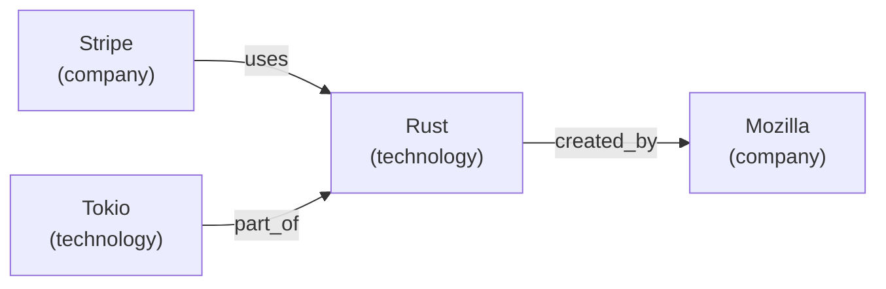

## What the Knowledge Graph Does

As an AI agent browses the web, it encounters entities: companies, people, technologies, products, and locations. The knowledge graph lets you capture these entities and their relationships so the agent builds up structured understanding over time.

Unlike the page cache (which stores raw content) or embeddings (which store vectors), the knowledge graph stores **structured facts**: "Stripe is a company," "Stripe uses Rust," "Patrick Collison is CEO of Stripe." These facts persist across browsing sessions and can be queried, visualized, and merged.

---

## entity_add

Add an entity to the knowledge graph with a name, type, and optional attributes.

**Parameters:**

| Parameter | Type | Required | Description |
|-----------|------|----------|-------------|
| `name` | string | yes | Entity name (e.g., `"Stripe"`, `"Rust"`) |
| `entity_type` | string | yes | One of: `"company"`, `"person"`, `"technology"`, `"product"`, `"location"`, `"other"` |
| `attributes` | object | no | Key-value pairs for additional metadata |

**Example request:**

```json
{
  "tool": "entity_add",
  "arguments": {
    "name": "Stripe",
    "entity_type": "company",
    "attributes": {
      "founded": "2010",
      "headquarters": "San Francisco",
      "industry": "payments",
      "url": "https://stripe.com"
    }
  }
}
```

**Example response:**

```json
{
  "name": "Stripe",
  "entity_type": "company",
  "attributes": {
    "founded": "2010",
    "headquarters": "San Francisco",
    "industry": "payments",
    "url": "https://stripe.com"
  },
  "created": true
}
```

If an entity with the same name already exists, its attributes are merged (new keys are added, existing keys are updated).

---

## entity_relate

Create a directed relationship between two entities. Both entities must already exist in the graph.

**Parameters:**

| Parameter | Type | Required | Description |
|-----------|------|----------|-------------|
| `from` | string | yes | Source entity name |
| `to` | string | yes | Target entity name |
| `relationship` | string | yes | Relationship label (e.g., `"uses"`, `"employs"`, `"competes_with"`, `"acquired"`) |

**Example request:**

```json
{
  "tool": "entity_relate",
  "arguments": {
    "from": "Stripe",
    "to": "Rust",
    "relationship": "uses"
  }
}
```

**Example response:**

```json
{
  "from": "Stripe",
  "to": "Rust",
  "relationship": "uses",
  "created": true
}
```

### Relationship conventions

Relationships are free-form strings. Some common patterns:

| Relationship | Meaning | Example |
|-------------|---------|---------|
| `uses` | Technology adoption | Stripe uses Rust |
| `employs` | Employment | Stripe employs Patrick Collison |
| `competes_with` | Market competition | Stripe competes_with Square |
| `acquired` | Acquisition | Stripe acquired Paystack |
| `founded_by` | Founder relationship | Stripe founded_by Patrick Collison |
| `located_in` | Geographic location | Stripe located_in San Francisco |
| `depends_on` | Technical dependency | Tokio depends_on mio |
| `part_of` | Containment | async-std part_of Rust ecosystem |

---

## entity_query

Query the knowledge graph with a natural language question. The system matches the question against entity names, types, attributes, and relationships to return relevant facts.

**Parameters:**

| Parameter | Type | Required | Description |
|-----------|------|----------|-------------|
| `question` | string | yes | Natural language question |

**Example request:**

```json
{
  "tool": "entity_query",
  "arguments": {
    "question": "what do we know about Stripe?"
  }
}
```

**Example response:**

```json
{
  "entities": [
    {
      "name": "Stripe",
      "entity_type": "company",
      "attributes": {
        "founded": "2010",
        "headquarters": "San Francisco",
        "industry": "payments",
        "url": "https://stripe.com"
      },
      "relationships": [
        { "to": "Rust", "relationship": "uses" },
        { "to": "Paystack", "relationship": "acquired" },
        { "to": "Patrick Collison", "relationship": "employs" },
        { "to": "Square", "relationship": "competes_with" }
      ]
    }
  ],
  "answer": "Stripe is a payments company founded in 2010, headquartered in San Francisco. It uses Rust, acquired Paystack, and competes with Square."
}
```

---

## entity_merge

Merge two entities when you discover they refer to the same thing. The second entity is merged into the first: all attributes and relationships from entity B are transferred to entity A, and entity B is deleted.

**Parameters:**

| Parameter | Type | Required | Description |
|-----------|------|----------|-------------|
| `name_a` | string | yes | Primary entity (survives the merge) |
| `name_b` | string | yes | Entity to merge into the primary (deleted after merge) |

**Example request:**

```json
{
  "tool": "entity_merge",
  "arguments": {
    "name_a": "Stripe",
    "name_b": "Stripe, Inc."
  }
}
```

**Example response:**

```json
{
  "merged_into": "Stripe",
  "removed": "Stripe, Inc.",
  "attributes_gained": 0,
  "relationships_gained": 2
}
```

This is essential for deduplication. During browsing, the same entity often appears under slightly different names ("Stripe" vs. "Stripe, Inc." vs. "Stripe Payments"). Merging consolidates all their facts into a single node.

---

## entity_search

Fuzzy search for entities by name. Useful when you are not sure of the exact entity name or want to find all entities matching a pattern.

**Parameters:**

| Parameter | Type | Required | Description |
|-----------|------|----------|-------------|
| `query` | string | yes | Search query (fuzzy name match) |

**Example request:**

```json
{
  "tool": "entity_search",
  "arguments": {
    "query": "stri"
  }
}
```

**Example response:**

```json
{
  "results": [
    {
      "name": "Stripe",
      "entity_type": "company",
      "score": 0.95
    },
    {
      "name": "String (Rust type)",
      "entity_type": "technology",
      "score": 0.62
    }
  ]
}
```

---

## entity_find_related

Find all entities connected to a given entity through any relationship, in either direction.

**Parameters:**

| Parameter | Type | Required | Description |
|-----------|------|----------|-------------|
| `name` | string | yes | Entity name to find connections for |

**Example request:**

```json
{
  "tool": "entity_find_related",
  "arguments": {
    "name": "Rust"
  }
}
```

**Example response:**

```json
{
  "entity": "Rust",
  "related": [
    { "name": "Stripe", "relationship": "uses", "direction": "incoming" },
    { "name": "Cloudflare", "relationship": "uses", "direction": "incoming" },
    { "name": "Tokio", "relationship": "part_of", "direction": "incoming" },
    { "name": "Mozilla", "relationship": "created_by", "direction": "outgoing" },
    { "name": "LLVM", "relationship": "depends_on", "direction": "outgoing" }
  ]
}
```

The `direction` field indicates whether the given entity is the source (`outgoing`) or target (`incoming`) of the relationship.

---

## entity_visualize

Generate a Mermaid diagram of the entire knowledge graph (or a subset, for large graphs). The output is valid Mermaid syntax that can be rendered in any Mermaid-compatible viewer.

**Parameters:** None.

**Example request:**

```json
{
  "tool": "entity_visualize",
  "arguments": {}
}
```

**Example response:**

```json
{
  "mermaid": "graph LR\n  Stripe[\"Stripe\\n(company)\"]\n  Rust[\"Rust\\n(technology)\"]\n  Tokio[\"Tokio\\n(technology)\"]\n  Mozilla[\"Mozilla\\n(company)\"]\n  Stripe -->|uses| Rust\n  Tokio -->|part_of| Rust\n  Rust -->|created_by| Mozilla"
}
```

Rendered, this produces:



---

## Building a knowledge graph during research

Here is a realistic workflow for building a knowledge graph while researching a topic.

### Step 1: Browse a page and extract entities

```json
{
  "tool": "browse_navigate",
  "arguments": { "url": "https://stripe.com/about" }
}
```

Read the page content and identify entities.

### Step 2: Add discovered entities

```json
{
  "tool": "entity_add",
  "arguments": {
    "name": "Stripe",
    "entity_type": "company",
    "attributes": { "founded": "2010", "industry": "payments" }
  }
}
```

```json
{
  "tool": "entity_add",
  "arguments": {
    "name": "Patrick Collison",
    "entity_type": "person",
    "attributes": { "role": "CEO" }
  }
}
```

### Step 3: Create relationships

```json
{
  "tool": "entity_relate",
  "arguments": {
    "from": "Stripe",
    "to": "Patrick Collison",
    "relationship": "founded_by"
  }
}
```

### Step 4: Continue browsing and enriching

As the agent visits more pages, it adds new entities and relationships. Over time, the graph grows into a connected web of facts.

### Step 5: Query the accumulated knowledge

```json
{
  "tool": "entity_query",
  "arguments": {
    "question": "which companies use Rust?"
  }
}
```

### Step 6: Visualize the graph

```json
{
  "tool": "entity_visualize",
  "arguments": {}
}
```

The graph is an in-memory structure that persists for the lifetime of the server process. It is designed for session-scoped research tasks where the agent needs to track relationships across dozens or hundreds of pages.
